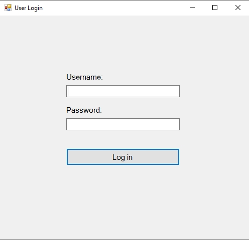
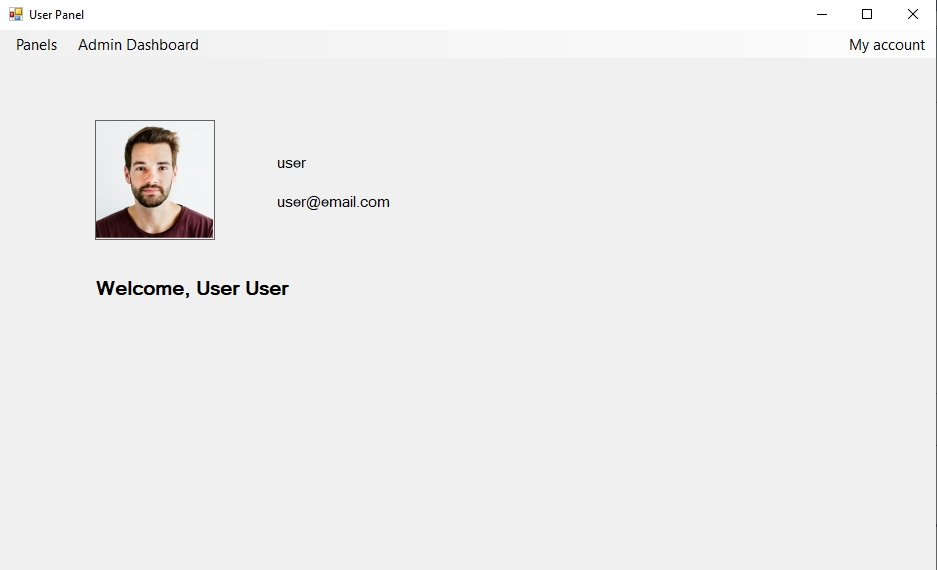
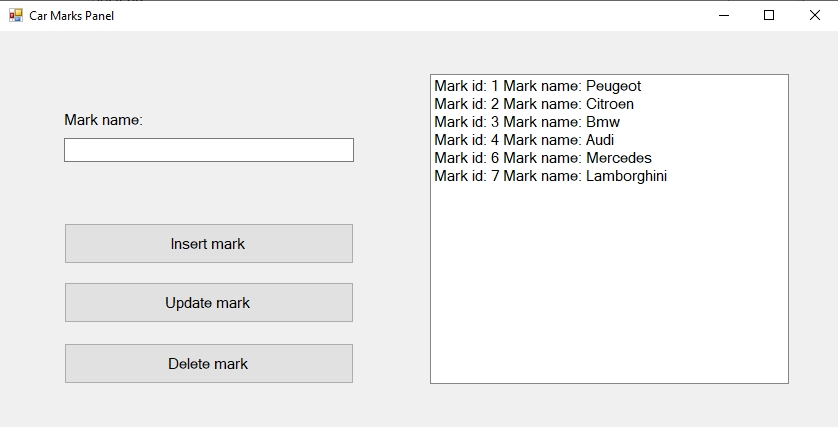
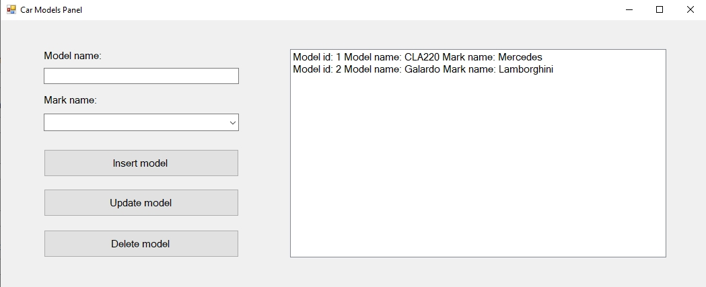
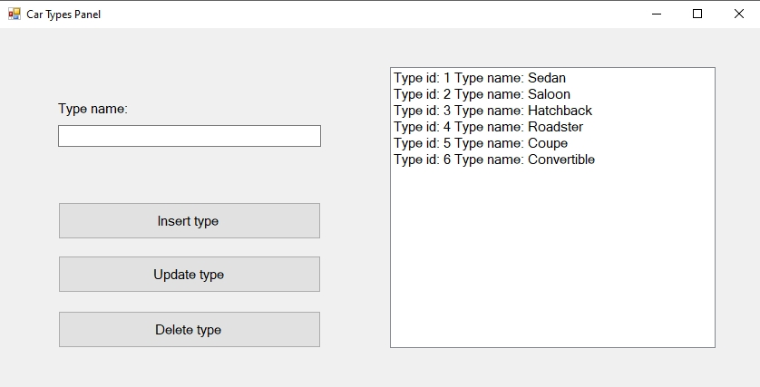
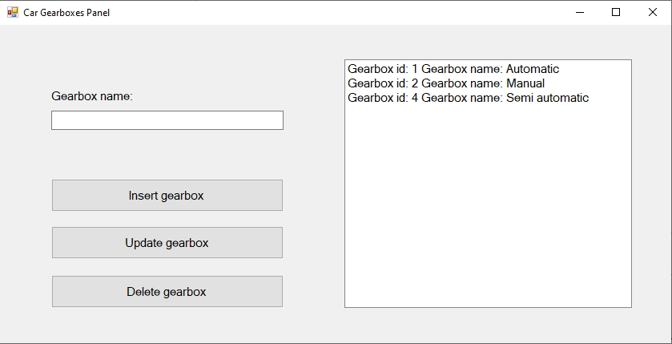
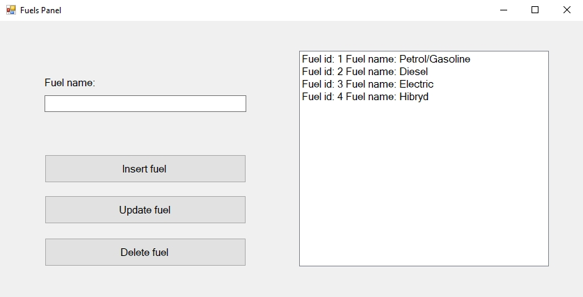
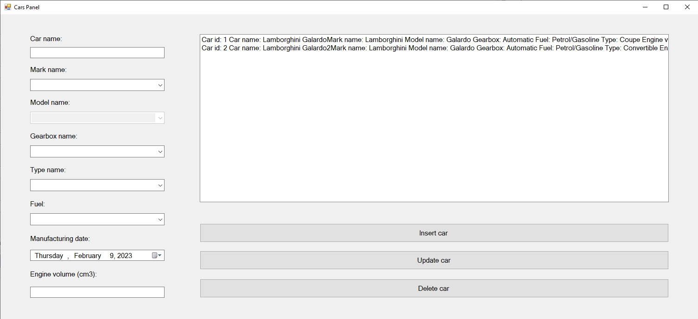
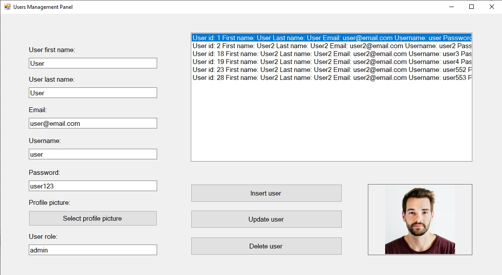

# Cars Shop App
Simple cars shop management app written in C# with SQL Server database

### Cars shop app views:
- ### Log in panel

- ### Users panel

- ### Car Marks panel

- ### Car Models panel

- ### Car Types panel

- ### Car Gearboxes panel

- ### Fuels panel

- ### Cars panel

-### User Management panel

